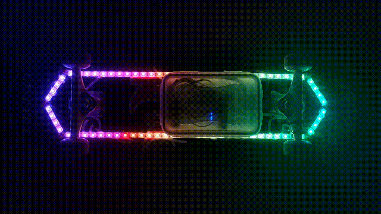
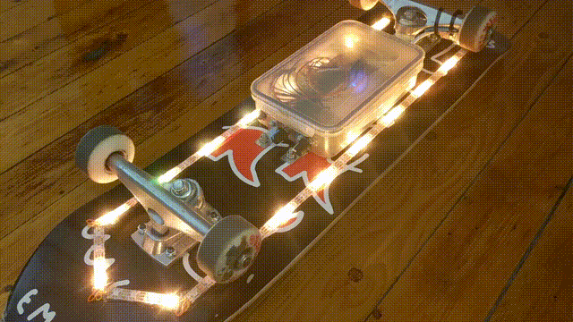

# Skate following underglow

Using a Hall effect sensor and magnets embedded into a wheel, we measure the movement of a skateboard and use that information to animate LEDs.

This project uses WS2812B LEDs, a Teensy LC and a TLE4966 dual Hall effect sensor.

Since the timing for the WS2812B LEDs is very strict, the excellent [WS2812Serial library](https://github.com/PaulStoffregen/WS2812Serial) by Paul Stoffregen is used to keep interrupts available for the Hall effect sensor.

The [FastLED library](https://github.com/FastLED/FastLED) is also used so the LEDs can be controlled using HSV values instead of RGB.

Sketch uploaded to Teensy board with Arduino 1.8.13 & Teensyduino 1.53.

TODO:
- Optimization: use memcpy() in the LED patterns. Currently every LED value is calculated every frame, despite most of the values just moving along on the strip. Really the only values that need to be calculated are the those at the tip of the board (in the direction the board is moving), the other values can just be copied downwards. This is only implemented in theaterLights() so far.
- Implement actual speed calculations, only distance is used right now. Add animations that use speed values.
- The old tupperware used as enclosure cost nothing and is practically watertight but is ugly as hell. Miniaturize with an actual PCB and custom printed case?

Lessons learned:
- The adhesive back on the LED strips can be pretty crap. My strips would unstick after a day or so. Hot glue on left and right of the strip on its entire length seems to work fine.
- WS2812b's have strict timing requirements and they don't care that you need interrupts :^)
- Don't trust the LED strip manufacturer when they say the LEDs are GRB, the actual order was BRG. Testing this earlier would have avoided a lot of confusion.
- The small cover piece for the Hall effect sensor was made with ferromagnetic sheet metal, so when the wheel spins, there is some "drag" caused by the attraction of the wheel magnets to the sensor cover, slowing down the wheel a bit. This has a very minor effect on Alumminium could have been used to avoid this.

